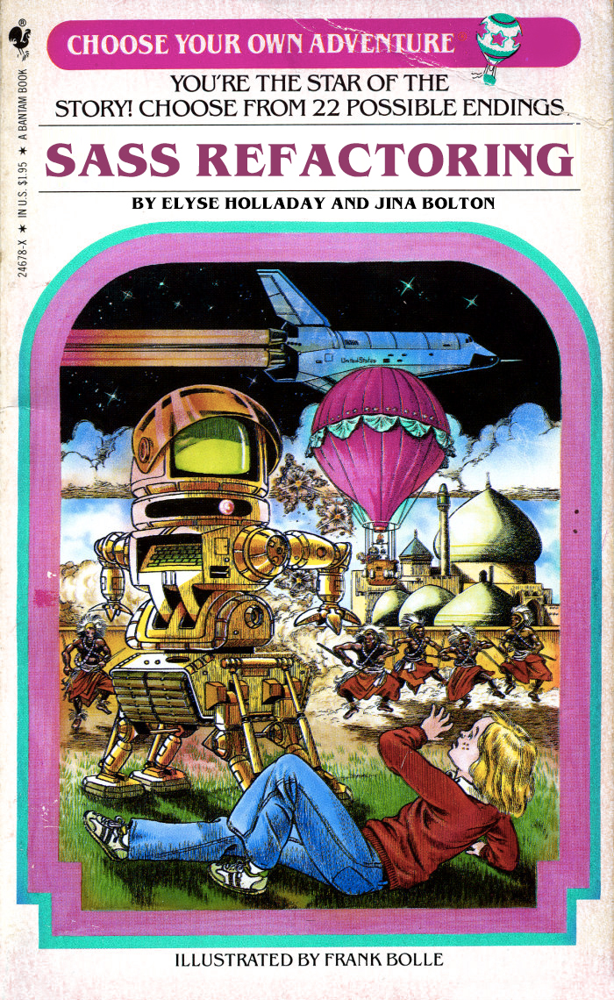

# Choose your own Refactoring Adventure!
#### A workshop at SassConf 2014 by Elyse Holladay & Jina Bolton

## Overview

Whether you’ve been using Sass for a while or are still trying to figure out how to abandon plain CSS, refactoring a large project can be a daunting task. We all know it’s too hard to refactor everything for months and launch it all at once, so how do you begin a multi-step refactoring process?

Jina Bolton is a San Francisco-based designer and developer best known for her work with Team Sass Design, speaking at conferences, and co-authoring two books: Fancy Form Design and The Art & Science of CSS. Currently she’s a Senior Product Designer with Salesforce UX on the Systems team; she works collaboratively across product teams to help identify and document interaction and visual design patterns. Elyse Holladay is a developer and instructor at MakerSquare, an Austin-based dev school. She has been involved in two large refactoring projects: taking three separate HTML & CSS codebases to a single, shared Sass codeset and a complete UI overhaul of a multi-app enterprise project. Their experience in maintaining large codebases has given them insight into the pitfalls—and joys—of refactoring.

In this four-hour workshop, Jina and Elyse will walk you through the basics of refactoring using Sass. You’ll receive guidelines for how to refactor for clarity, maintainability, efficiency, and DRY code, and learn how to test your changes. They’ll cover ways to break down a refactor into manageable chunks, help you understand how to modularize your CSS, and organize messy code into documented, style-guide ready files. Everyone will leave with a customized game plan of steps, tools, and guidelines to refactor their project—not a sample app—so bring your project code with you.

## Navigating this Repo

### /files

This folder contains a few items for your reference during the workshop.

* **schedule.md** — Today's schedule
* **worksheet.pdf** — A worksheet for you to fill out during the workshop, to give you a checklist of things you can do to refactor your project when you leave! You'll receive a paper version of this as well.

### /resources

There is a resources doc for each section of the workshop. These contain all kinds of links and goodies for more details on what we cover during the day. You'll find lots of information on how other people tackle similar issues, build front-end architectures, and more in-depth tutorials.

### /exercise

The workshop exercises will be determining some modules in your project that you can break out and refactor. Depending on time we'll actually get started refactoring one!

If you didn't bring your own project code to work on, there's a sample module in this folder you can work on. See the README in that folder for more details.

## Slides

Slides are available online at [link TBD] for your following-along pleasure!

## Contact Us

Want to get in touch with us about the workshop? More questions or feedback? We're best reached on Twitter.

### Jina Bolton

[http://twitter.com/jina](@jina)

### Elyse Holladay

[http://twitter.com/elyseholladay](@elyseholladay)
